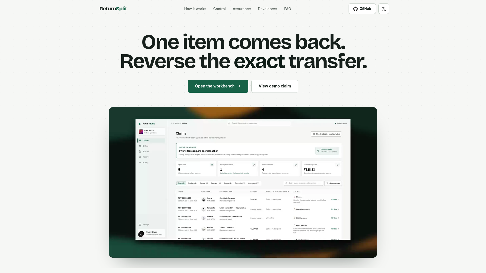
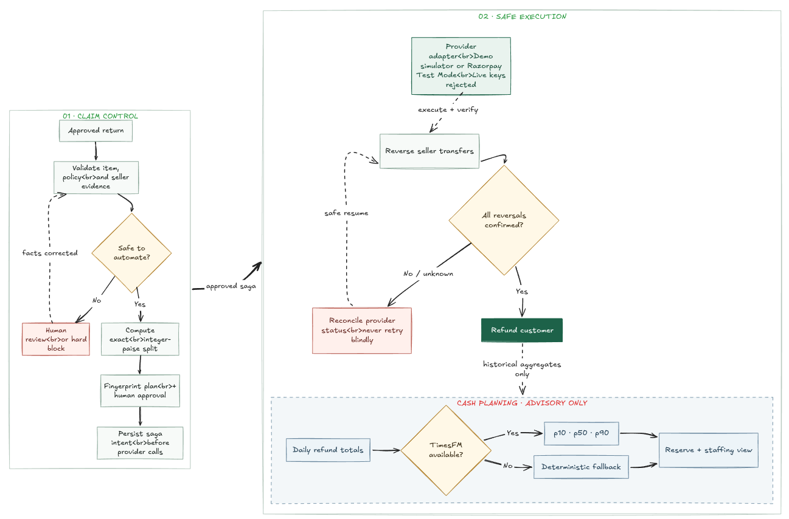
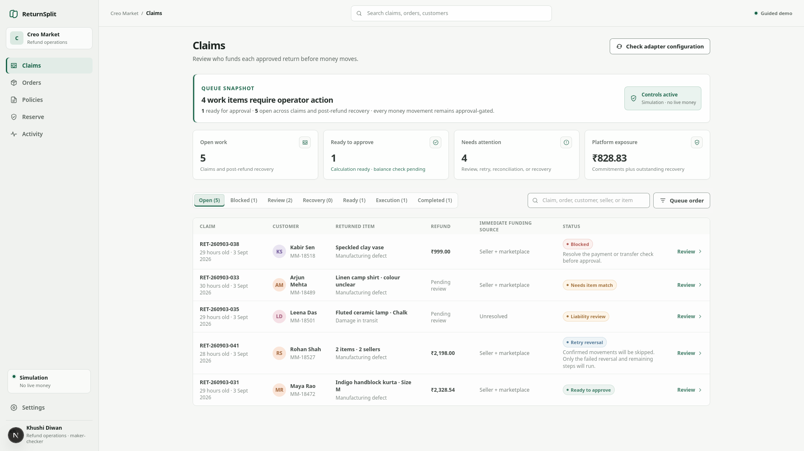
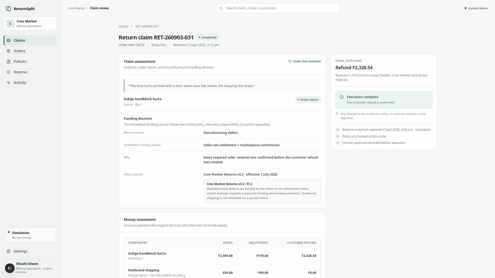
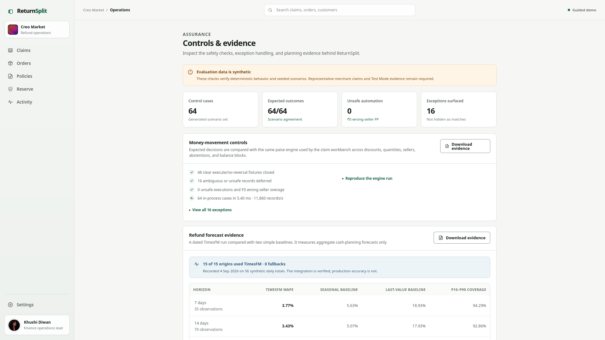
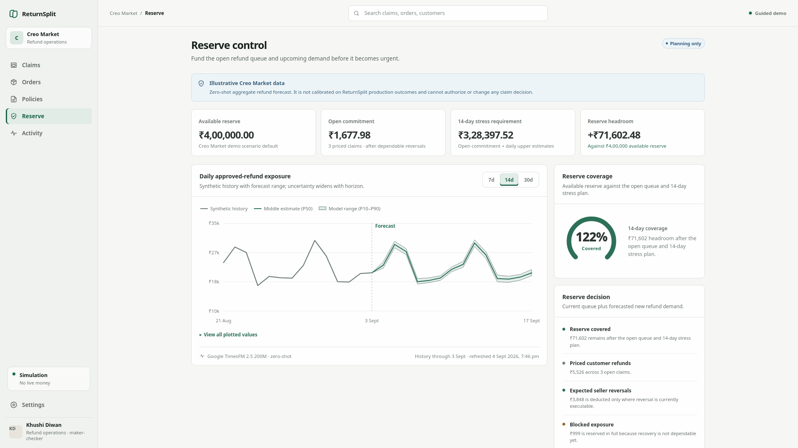

# ReturnSplit

> Map every approved marketplace refund to the right seller transfer.

[Live demo](https://returnsplit.com) · [Open the workbench](https://returnsplit.com/claims) · [Review the evaluation](https://returnsplit.com/evaluation)

A partial refund on a multi-seller order is not one payment action. Finance must identify the returned line, unwind the correct seller transfer, apply policy and discount rules without losing a paise, and refund the customer exactly once.

ReturnSplit is a finance-control workbench for that gap. It starts after a return is approved and produces an exact, reviewable reversal plan or stops the case before money moves.

Built for Razorpay AI Buildathon 2026, Track 04: AI Finance Controller.

[](https://returnsplit.com)

## Control loop

1. Accept an approved claim with proposed returned-line and policy evidence. The included scenarios use precomputed extraction fixtures.
2. Validate the proposal against the order, seller ownership, frozen policy, quantities, payment, and Razorpay Route transfer snapshot.
3. Calculate seller recovery, marketplace contribution, discounts, shipping, and the customer refund in integer paise.
4. Abstain when evidence is ambiguous; block when the plan is invalid or the required transfer balance is insufficient.
5. Freeze the plan behind a SHA-256 fingerprint, refresh provider balances, and require named human approval.
6. Persist execution intent, confirm every required seller reversal, and only then create the customer refund.
7. Reconcile uncertain provider responses before retrying and expose a redacted claim audit bundle.

The money path is deterministic. Models cannot choose liability, amounts, transfers, approval, or execution priority. TimesFM is isolated to aggregate refund-reserve planning.

## Evidence included in the repository

`pnpm eval:batch` runs the workbench's paise engine against 64 independently labeled, pre-structured control fixtures.

| Result | Included run |
| --- | ---: |
| Exact expected decisions | 64 / 64 |
| Automated outcomes | 48 |
| Exceptions surfaced | 16 |
| Unsafe automations | 0 |
| Wrong-seller overage | 0 paise |

The 48 automated outcomes comprise 40 `execute` and 8 `no_reversal` decisions. The exception set contains 12 `abstain` and 4 `blocked` decisions covering ambiguous items, unclear liability, and insufficient balances.

This validates fixture agreement for the post-extraction control loop. It is not extraction-model accuracy, production capacity, or evidence from real claims. See the [evaluation contract](src/evaluation/batch.ts) and [methodology](docs/evaluation.md).

## Golden path and safe failure

Start with [claim `RET-260903-031`](https://returnsplit.com/claims/RET-260903-031). The reviewed plan resolves to:

| Movement | Amount |
| --- | ---: |
| Aavya Textiles transfer reversal | ₹1,979.26 |
| Creo Market contribution | ₹349.28 |
| Customer refund | ₹2,328.54 |
| Outbound shipping refund | ₹0.00 |

The operator refreshes balances, approves the displayed fingerprint, and executes. The saga confirms the seller reversal before creating the refund. Repeating the approval resumes the same operation rather than creating a duplicate effect.

Then open [claim `RET-260903-038`](https://returnsplit.com/claims/RET-260903-038). Its required seller transfer has only ₹49.15 remaining after an earlier partial reversal. ReturnSplit blocks approval, creates no refund, and lets the operator open a payments-reconciliation case.

The default hosted workflow uses the simulator and makes no Razorpay network request. Golden-case amounts are asserted in [`tests/refund-engine.test.ts`](tests/refund-engine.test.ts); ordering, retry, and reconciliation behavior are covered in [`tests/execution-saga.test.ts`](tests/execution-saga.test.ts).

## Architecture



Claim control and reserve planning are separate trust boundaries. Forecast output cannot change eligibility, liability, seller selection, exact amounts, approval, or execution priority.

| Runtime path | Implemented behavior | Boundary |
| --- | --- | --- |
| Deterministic simulator | Success, block, retry, and unknown-result scenarios without a provider request | In-memory and process-local; cannot move real money |
| Razorpay Test Mode adapter | Payment and transfer preflight, transfer reversal, refund idempotency, bounded timeouts, and receipt-based reconciliation | Requires matching imported Test Mode identifiers; seeded demo IDs are rejected; no external Test Mode trace is claimed |
| TimesFM 2.5 sidecar | Validated p10/p50/p90 forecasts for aggregate refund exposure | Falls back to a visibly labeled deterministic baseline when the service is missing, slow, unavailable, or invalid |

Live Razorpay keys are rejected by construction.

## Product walkthrough

| Claims queue | Completed golden claim |
| --- | --- |
|  |  |

| Control evaluation | Reserve planning |
| --- | --- |
|  |  |

Useful routes:

| Route | What to inspect |
| --- | --- |
| [Claims](https://returnsplit.com/claims) | Operator queue, filters, and control states |
| [Orders](https://returnsplit.com/orders) | Multi-seller payment and transfer context |
| [Policies](https://returnsplit.com/policies) | Frozen return-policy rules |
| [Reserve](https://returnsplit.com/risk) | Aggregate 7/14/30-day exposure planning with source labels |
| [Evaluation](https://returnsplit.com/evaluation) | Synthetic control replay and forecast evidence |
| [Activity](https://returnsplit.com/activity) | Decision, execution, and provider-event history |
| [Settings](https://returnsplit.com/settings) | Provider identity, reset controls, and seeded scenarios |

## Run locally

The simulator needs no provider or model credentials.

```bash
pnpm install
pnpm dev
```

Open [http://localhost:3000](http://localhost:3000). To reproduce the checks:

```bash
pnpm test
pnpm eval:batch
pnpm eval:forecast
pnpm test:timesfm
pnpm typecheck
pnpm lint
pnpm build
```

Optional server-side configuration is documented in [`.env.example`](.env.example). Keep `RETURNSPLIT_PROVIDER_MODE=demo` for seeded workflows. Use `razorpay_test` only with Test Mode credentials and matching imported identifiers that you control. TimesFM sidecar setup is documented in [`services/timesfm/README.md`](services/timesfm/README.md).

## Implemented controls

- Integer-paise arithmetic, conservation checks, largest-remainder discount allocation, and refundable/reversible balance caps.
- Frozen policy, evidence, seller mapping, quantities, provider snapshot, and amounts bound into the approval fingerprint.
- Provider balances re-fetched before a new execution saga; any material drift fails closed.
- Persisted intent, resumable reversal-before-refund execution, stable receipts, and refund idempotency.
- Unknown provider outcomes reconciled from provider state before any retry.
- Human review, evidence requests, payment-reconciliation cases, marketplace recovery tracking, and redacted audit export.
- HMAC-SHA256 webhook verification, secret rotation, body limits, event deduplication, and payload-conflict detection.
- Browser payloads and audit exports omit customer email, linked-account IDs, credentials, and raw provider identifiers.
- Reproducible synthetic control replay, randomized invariants, provider, saga, webhook, API, and forecast tests.

See the [architecture](docs/architecture.md) and [threat model](docs/threat-model.md) for the full trust boundaries and remaining gaps.

## Prototype boundary

This repository is a working prototype and engineering harness, not production financial infrastructure.

The included claim evidence is precomputed, state is process-local, and the hosted demo runs the simulator. The server-side Razorpay adapter accepts Test Mode credentials only, but this repository does not claim a recorded external Test Mode transaction. TimesFM and its deterministic fallback support aggregate reserve planning only.

Production use still requires authenticated tenant isolation, role-based and maker-checker authorization, durable transactional storage and queues, encrypted evidence retention, immutable audit records, rate limits, monitored secrets, representative extraction evaluation, recorded Test Mode traces, shadow-mode comparison, forecast calibration, and operational runbooks.

No production extraction accuracy, live-money deployment, customer savings, or marketplace throughput is claimed.

## References

- [Razorpay AI Buildathon](https://razorpay.com/buildathon/)
- [Razorpay Route: refund payments and reverse transfers](https://razorpay.com/docs/api/payments/route/refund-payments-and-reverse-transfer/)
- [Razorpay Route: reverse a transfer](https://razorpay.com/docs/api/payments/route/reverse-a-transfer/)
- [Google Research TimesFM](https://github.com/google-research/timesfm)
- [TimesFM 2.5 model card](https://huggingface.co/google/timesfm-2.5-200m-pytorch)
- [Evaluation methodology](docs/evaluation.md)
- [Judge runbook](docs/judge-runbook.md)
- [Business case](docs/business-case.md)
